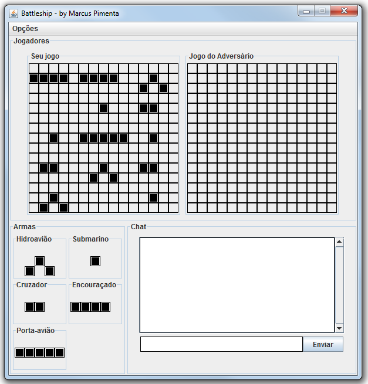

Battleship-Game
===============

  

##Build status
Last build in Travis continuous integration  

##About
Implement the Battleships Game using sockets as communication. One of the users is the server connection and the other the client.
Users can also exchange messages through a chat.

##Download
You can download it in the .jar format:  
[last version](https://raw.github.com/marcuspimenta/Battleship-Game/master/build/battleship.jar)

##Author
Marcus Vinícius Pimenta  
email: [mvinicius.pimenta@gmail.com](mailto:mvinicius.pimenta@gmail.com)
