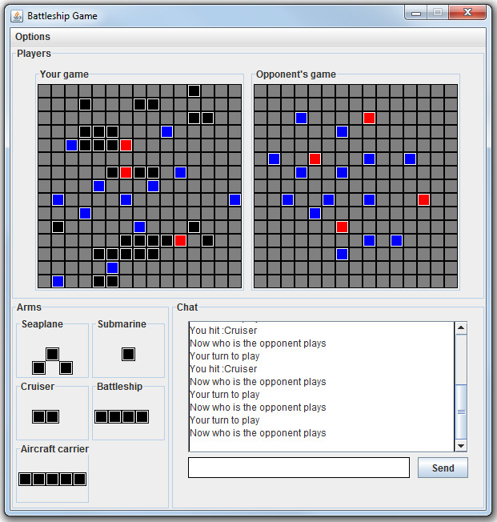
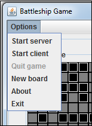
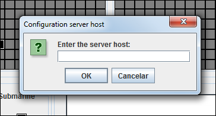

Battleship Game
===============

  

##About
Implement the Battleships Game using sockets as communication. One of the users is the server connection and the other the client.
Users can also exchange messages through a chat.

##Start the game
Start the game the user must choose to start as server or client. The user can start the server or client accessing the menu Options.

  

If the user start as server socket connection will open for 30 seconds, waiting for a connection. If the timeout for connection exceeded 
is necessary to start the server again. When the server is opened and the timeout for connection exceeded a message is displayed 
informing the user what is happening.

  

If the user start as client socket connection is necessary enter the server host.

  

When the connection is successfully a message is displayed to both players saying that the connection was successful.

  

Each player can play three times in a game. When the player hits an opponent's piece this piece change color for red, if you miss the 
opponent's piece this piece change color for blue. Each movement was a message informing that the piece was hit, is also informed if 
the arm was sunk.

  

When a player wins the game a popup informs that he won the match, a popup also informs the loser that he lost the match.

  

##Build status
Last build in Travis continuous integration  

##Download
You can download it in the .jar format:  
[last version](https://raw.github.com/marcuspimenta/Battleship-Game/master/build/battleship.jar)

##Author
Marcus Vinícius Pimenta  
email: [mvinicius.pimenta@gmail.com](mailto:mvinicius.pimenta@gmail.com)
